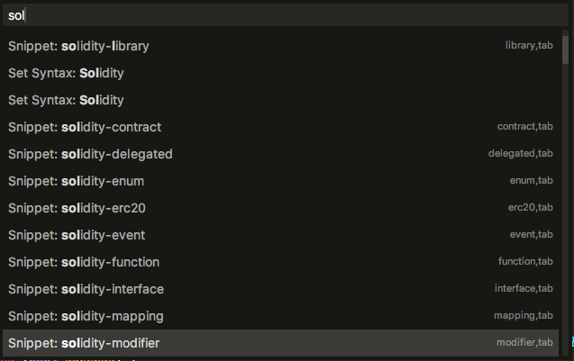

= EthereumSoliditySnippets

A set of SublimeText snippets for the Ethereum Solidity contract language.

Use +Control Package+ to install.

This package requires the great package from davidhq: https://github.com/davidhq/SublimeEthereum to recognize solidity code.

To get started, create a .sol file. SublimeText will then recognize your file as an Ethereum Solidity file and activate the syntax coloriring as well as the snippets.

To see the list of available snippets, open the Panel (Shift+Command+P) and type 'solidity'.

NOTE: All snippets are triggered by their Solidity name so they should come up automagically as you type.
